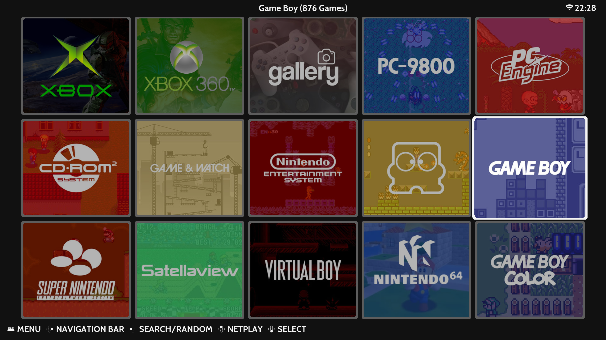
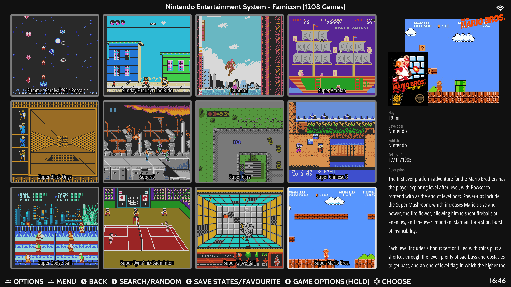
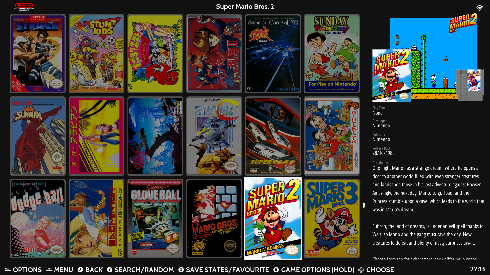

# ES-Theme-Tiled 
A simple, clean, grid-based EmulationStation theme designed for Steam Deck and other Handhelds running Batocera or RetroBat

## **System Grid**

## **Game Grid**

## **Box Grid**

## Colorways
- Extra Dark
- Dark
- Steam OS

## **Acknowledgments**
Assets for the Modern style taken from Alekfull-NX: https://github.com/fagnerpc/Alekfull-NX

Assets for the Carbon style taken from es-theme-carbon: https://github.com/fabricecaruso/es-theme-carbon

Assets for the Controllers style taken from es-de-moderntheme-nsoicons: https://github.com/szymon-kulak/es-de-moderntheme-nsoicons by Szymon Kulak

Used screenshots for systems : https://www.screenscraper.fr/

Thanks mikakunin for the additional system art