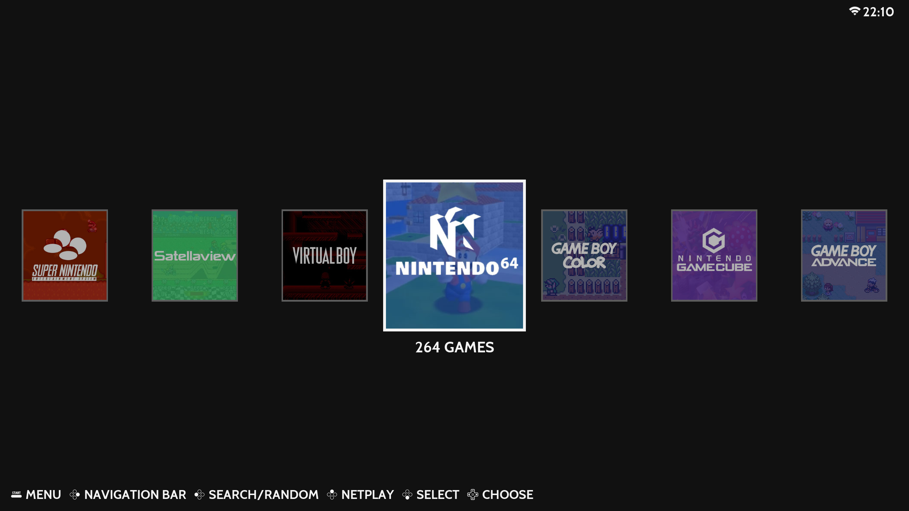
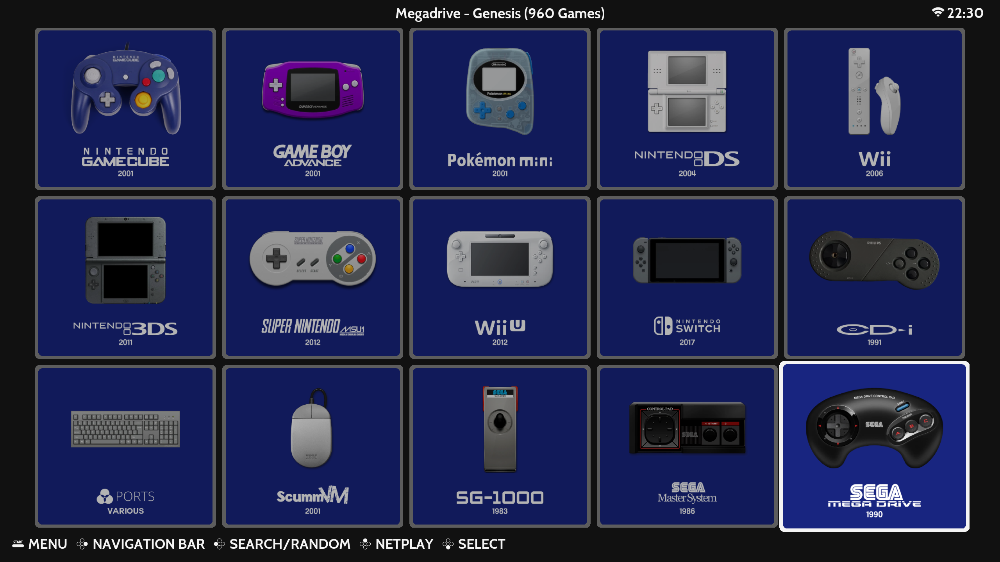
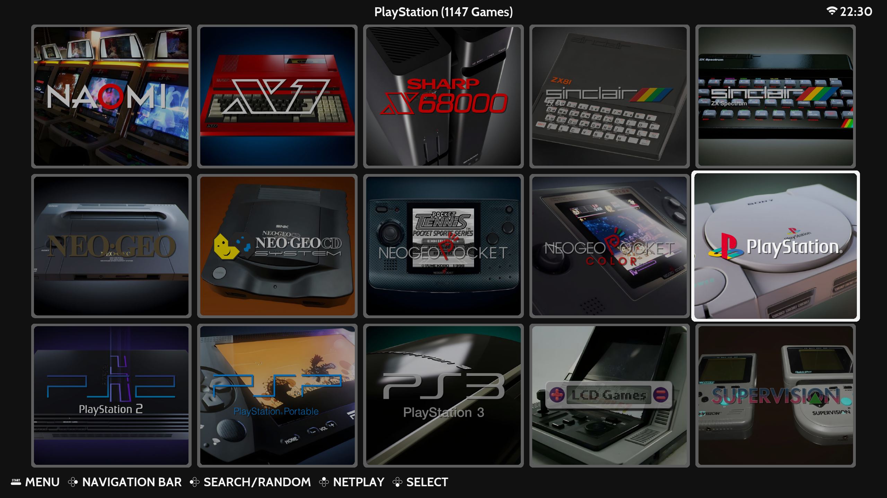
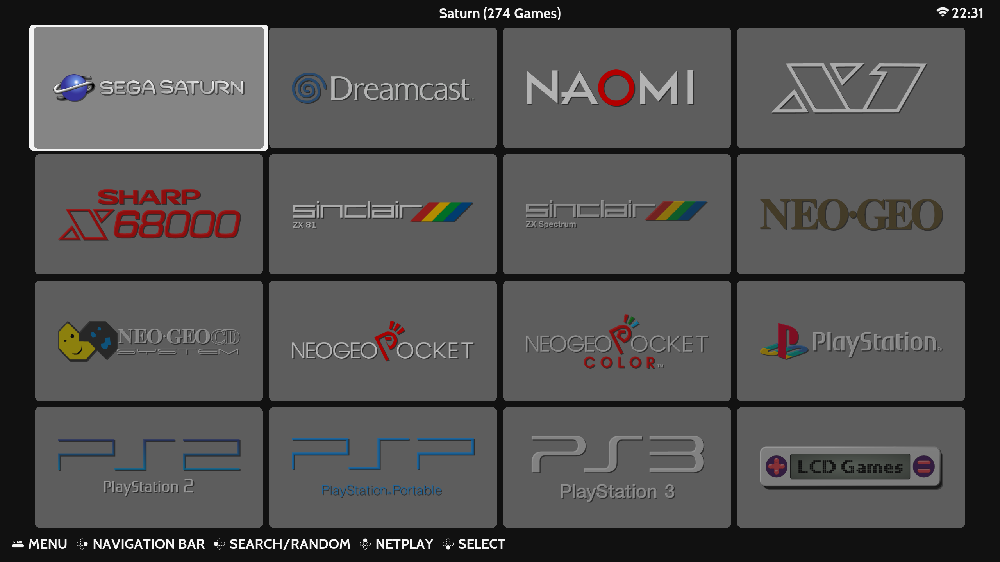
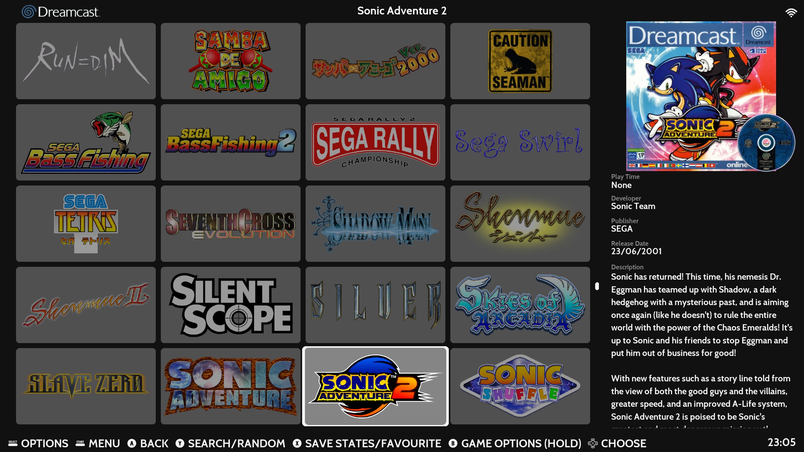

# ES-Theme-Tiled 
A simple, clean, grid-based EmulationStation theme designed for Steam Deck and other Handhelds running Batocera or RetroBat

## **System Views**

### **System Grid**

### **System Carousel**

## **Art Styles**

## **Default Grid**

## **Box Grid**

## **Marquee Grid**

## Colorways
- Extra Dark
- Dark
- Steam OS

## **Acknowledgments**
Assets for the Modern style and controller icons taken from Alekfull-NX: https://github.com/fagnerpc/Alekfull-NX

Assets for the Carbon style taken from es-theme-carbon: https://github.com/fabricecaruso/es-theme-carbon

Assets for the Controllers style taken from es-de-moderntheme-nsoicons: https://github.com/szymon-kulak/es-de-moderntheme-nsoicons by Szymon Kulak

Assets and code structure for system indicators taken from canvas-es: https://github.com/Siddy212/canvas-es by Siddy212

Used screenshots for systems : https://www.screenscraper.fr/

Thanks to mikakunin for the additional system art